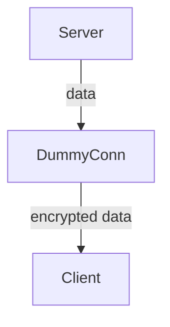
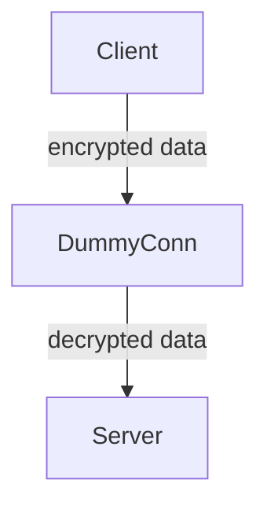

# DummyConn

## How it works

DummyConn is just a wrapper around net.Conn.
By accessing connections with a DummyConn you can let your data automatically get encrypted without even thinking about encryption.
The way of functioning is simply explained by the graphs below.

### Case 1 - The server sends data to the client

### Case 2 - The client sends data to the server

